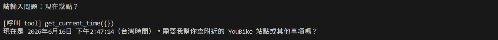
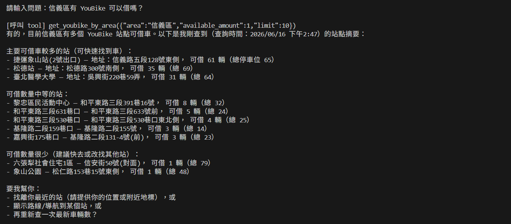
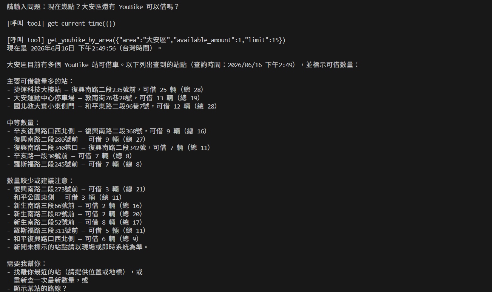

# YouBike Genie — 自然語言 YouBike 查詢助理

以自然語言查詢 YouBike 站點與現在時間的 CLI 工具。使用者輸入描述性的句子（例如「信義區有 YouBike 可以借嗎？」），系統透過 OpenAI Function Calling 自動呼叫對應工具並回傳即時結果。

## 架構

```
使用者以自然語言輸入問題
        ↓
  OpenAI GPT（Tool Calling）
        ↓
  ┌─────────────────────────────────┐
  │  get_current_time               │  取得台灣當前時間
  │  get_youbike_by_area            │  查詢指定區域可借站點
  └─────────────────────────────────┘
        ↓
  CLI 互動介面 (main.js)  →  輸入問題 → 呼叫工具 → 格式化回傳結果
        ↓
  對話歷程持久化 (lowdb / .history/)
```

## 技術棧

| 元件 | 說明 |
|------|------|
| OpenAI GPT | 解析使用者意圖並決定呼叫哪個工具 |
| Function Calling | 將查詢邏輯以工具形式定義，讓 GPT 自動呼叫 |
| YouBike 即時 Open Data API | 台北市 YouBike 2.0 即時站點資料 |
| Node.js + `readline` | 互動式 CLI 介面，逐行讀取使用者輸入 |
| `lowdb` | 將每次對話歷程以 JSON 格式儲存至 `.history/` |
| `zod` | 定義工具參數 schema，自動轉換為 OpenAI function schema |
| `ora` | 顯示思考中 spinner，提升使用體驗 |

## 支援功能

| 工具 | 功能 |
|------|------|
| `get_current_time` | 取得現在台灣時間（Asia/Taipei） |
| `get_youbike_by_area` | 依區域查詢可借 YouBike 站點，支援過濾最少可借數量與回傳筆數上限 |

## 快速開始

```bash
# 1. 安裝相依套件
npm install

# 2. 設定環境變數
cp .env.example .env
# 填入 OPENAI_API_KEY

# 3. 啟動查詢介面
npm start
```

直接按 `Enter` 離開程式。

## 查詢結果範例

### 查詢現在時間



### 查詢信義區 YouBike 可借站點



### 查詢現在時間以及大安區 YouBike 可借站點


